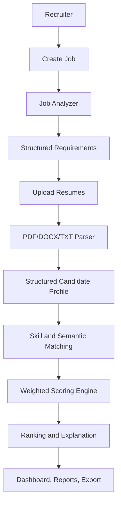

# AI Resume Screening & Recruitment System

# Live Demo

PythonAnywhere: [Resumescreener.pythonanywhere.com](https://resumescreener.pythonanywhere.com/)

Production-style AI resume screening web application for recruiters. The system creates jobs, analyzes job requirements, uploads large batches of resumes, parses candidate information, scores candidates with deterministic weighted matching, ranks candidates, explains recommendations, supports status workflows, compares candidates, and exports CSV/JSON results.

This project is structured for the ROOMAN Junior AI Research Associate 24-Hour AI Agent Challenge.

## Features

- Direct recruiter workflow without a required frontend login page
- Job creation, editing, closing, and job requirement analysis
- Batch resume upload for PDF, DOCX, and TXT files
- Parsing with PyMuPDF for PDF and python-docx for DOCX
- Candidate extraction for contact info, education, skills, experience, projects, certifications, links, and years of experience
- Deterministic weighted scoring with configurable weights
- Semantic matching using sentence-transformers when available, with TF-IDF fallback
- Related skill matching for terms such as Machine Learning/scikit-learn and Database/MySQL
- AI-style grounded candidate explanation generated from parsed data and scoring results
- Missing skills, ATS resume quality score, duplicate detection, ranking, comparison, reports, and exports
- Responsive React recruiter dashboard with mobile-friendly cards and tables

## Architecture



## Tech Stack

- Frontend: React, Vite, Tailwind CSS, Recharts, lucide-react
- Backend: Python 3.10, Flask, SQLAlchemy, Flask-JWT-Extended, SQLite
- NLP/AI: scikit-learn, sentence-transformers, deterministic extraction fallback, optional LLM environment variables
- Parsing: PyMuPDF, python-docx
- Data: SQLite database plus filesystem resume storage

## Repository Notes

No virtual environment is created or committed. Runtime folders are ignored:

- `venv/`, `.venv/`
- `node_modules/`
- `backend/instance/`
- `backend/uploads/`
- `backend/static/`
- `.env`

This keeps the GitHub repository small.

## Installation

Use Python 3.10.

```bash
git clone <repository-url>
cd resumescreener
copy .env.example .env
pip install -r requirements.txt
```

Frontend dependencies are installed separately and ignored by Git:

```bash
cd frontend
npm install
```

## Running

Backend:

```bash
cd backend
python app.py
```

Frontend:

```bash
cd frontend
npm run dev
```

Open the Vite URL shown in the terminal, usually:

```text
http://localhost:5173
```

The Vite dev server proxies `/api` requests to the Flask backend on `http://localhost:5000`.

For a production-style local run, build the frontend and let Flask serve it:

```bash
cd frontend
npm run build
cd ../backend
python app.py
```

Then open:

```text
http://localhost:5000/
```

## PythonAnywhere Deployment

See `README_DEPLOY.md` for the single-URL PythonAnywhere setup. In production, Flask serves `backend/static/index.html`, Vite assets under `/assets/*`, and the backend API under `/api/*`.

## API Overview

```text
POST   /api/auth/register
POST   /api/auth/login
POST   /api/auth/logout
GET    /api/auth/me

GET    /api/jobs
POST   /api/jobs
GET    /api/jobs/:id
PUT    /api/jobs/:id
DELETE /api/jobs/:id
POST   /api/jobs/:id/analyze
POST   /api/jobs/:id/close

POST   /api/screening/upload
POST   /api/screening/start
GET    /api/screening/:batch_id/status
GET    /api/screening/:batch_id/results

GET    /api/candidates
GET    /api/candidates/:id
PUT    /api/candidates/:id/status
POST   /api/candidates/compare

GET    /api/reports
GET    /api/export/csv
GET    /api/export/json
```

## Scoring Method

The LLM does not decide the final score. The app uses deterministic weighted scoring:

```text
Required Skills       35%
Experience            20%
Education             10%
Projects              15%
Preferred Skills      10%
Certifications         5%
Semantic Similarity    5%
```

Match categories:

```text
90-100%  Excellent Match
80-89%   Strong Match
70-79%   Good Match
60-69%   Review
<60%     Weak Match
```

## AI Pipeline

```text
Resume Parser
  -> Structured Candidate Extraction
  -> Skill and Category Matching
  -> Semantic Similarity
  -> Weighted Scoring
  -> Ranking
  -> Grounded Explanation
```

The explanation is generated only from candidate profile data, job requirements, matched skills, missing skills, component scores, and ATS feedback.

## Environment Variables

Copy `.env.example` to `.env` and update values as needed.

```text
SECRET_KEY=
JWT_SECRET_KEY=
DATABASE_URL=
UPLOAD_FOLDER=
MAX_UPLOAD_MB=
MAX_BATCH_UPLOAD_MB=
CORS_ORIGINS=
LLM_API_KEY=
LLM_MODEL=
LLM_API_URL=
VITE_API_URL=/api
```

The app runs without an LLM API key by using deterministic extraction and explanation fallbacks.

## Tests

```bash
pytest
```

Included coverage:

- Resume parsing for TXT, PDF, DOCX, corrupted PDF, and empty documents
- Exact and related skill matching
- Missing required skills
- Weighted scoring and match categories
- Duplicate text similarity
- Batch upload sizes for 10, 50, and 100 resumes

## Tradeoffs

- SQLite is used because it is lightweight, portable, and suitable for the challenge.
- Deterministic scoring is used for transparent and reproducible ranking.
- Embeddings are used for semantic matching, with TF-IDF fallback if the embedding model is unavailable.
- LLM configuration is isolated in environment variables, but the app remains runnable without external keys.
- Background processing uses a simple thread-based batch worker for the MVP. A production deployment should use a queue such as Celery/RQ.

## Limitations

- OCR is not implemented for scanned resumes.
- The deterministic extraction fallback is conservative and may miss unusual resume layouts.
- In-memory batch progress is reset when the backend restarts.
- The sentence-transformers model may download on first use after dependencies are installed.

## Future Improvements

- OCR for scanned PDFs
- Multilingual resume parsing
- Persistent job queue and retry worker
- Vector database for large-scale candidate search
- Bias evaluation reports
- Recruiter feedback loop
- Cloud deployment with object storage
